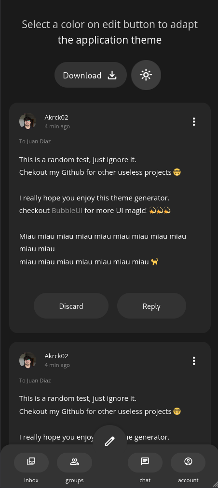
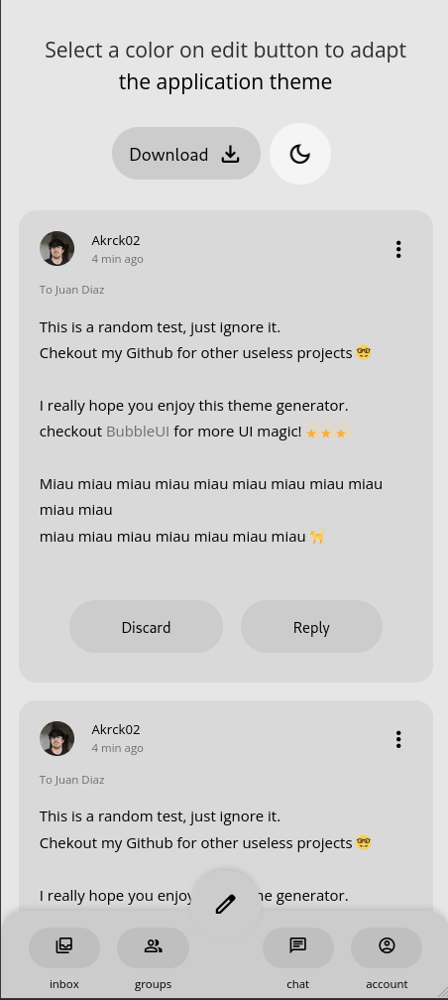
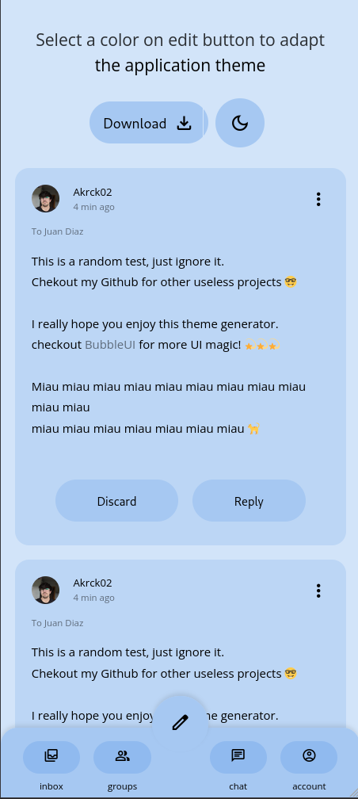
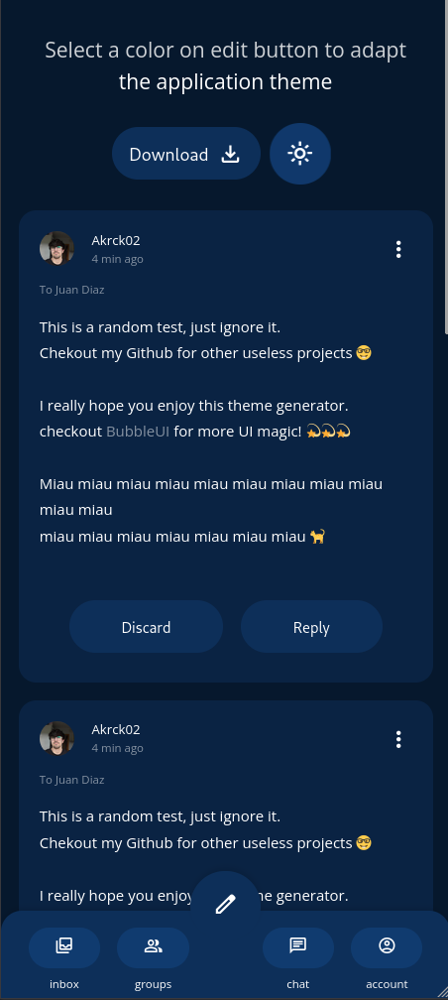
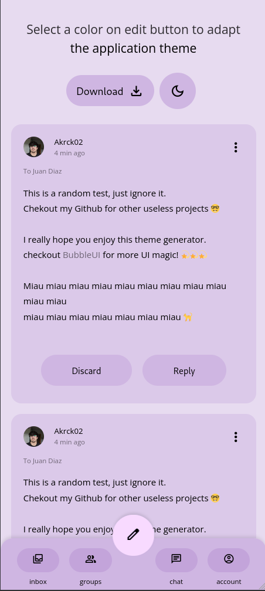
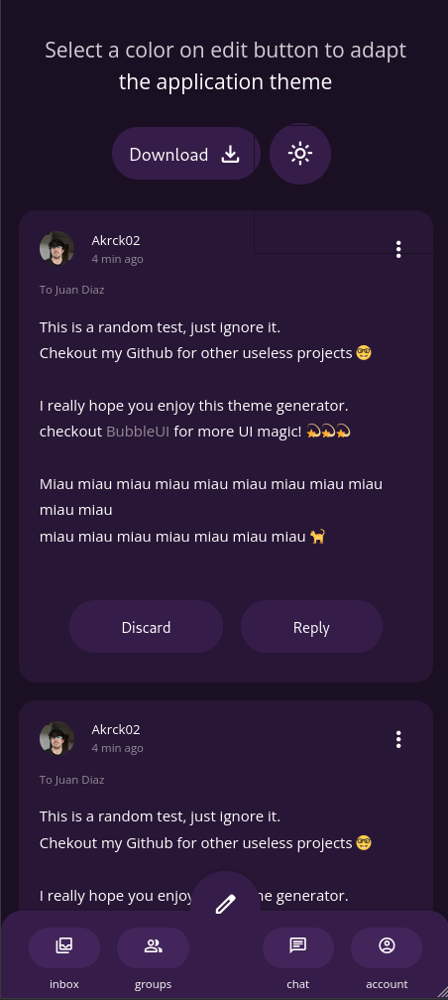
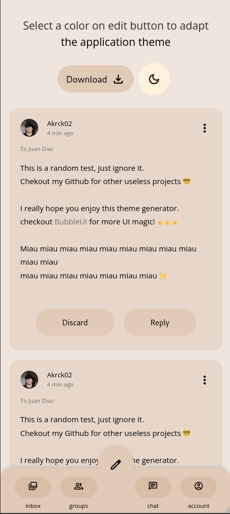
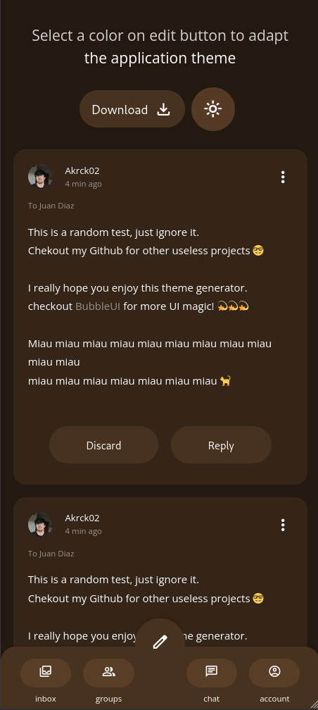

# Color extractor
Hi there! This is a library and a demo app to extract a cohesive color palette from a base color in dark / light mode!

This proyect was inspired by the new Material you design trend and free to use.

The extractor library returns a JSON with the following format:

```JSON
{
    "surface-1": "#262626",
    "on-surface-1": "#ffffff",
    "surface-2": "#333333",
    "on-surface-2": "#ffffff",
    "surface-3": "#404040",
    "on-surface-3": "#ffffff",
    "surface-4": "#4d4d4d",
    "on-surface-4": "#ffffff",
    "surface-5": "#595959",
    "on-surface-5": "#ffffff",
    "surface-6": "#666666",
    "on-surface-6": "#ffffff",
    "background": "#1a1a1a",
    "on-background": "#ffffff"
}
```

And the app using it rewrites the [BubbleUI](https://github.com/akrck02/Bubble-UI) variables to change the UI colors!

<div style="display:flex; flex-wrap:wrap;">










</div>